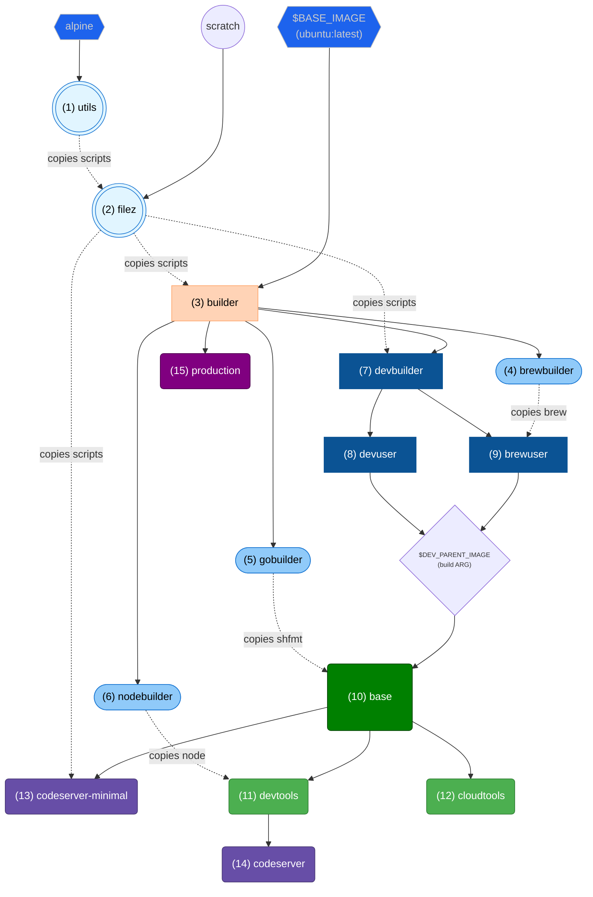
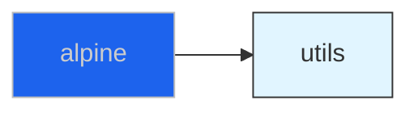
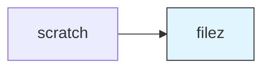
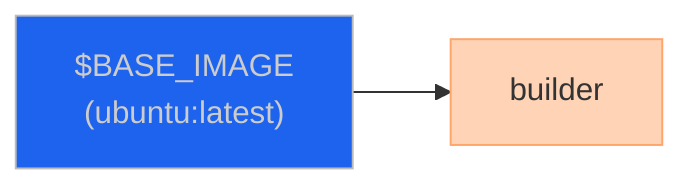
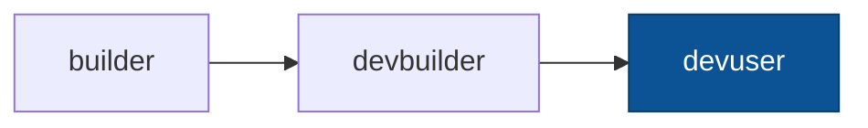
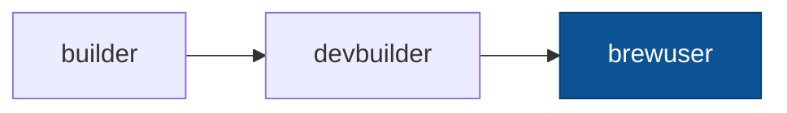
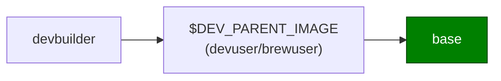
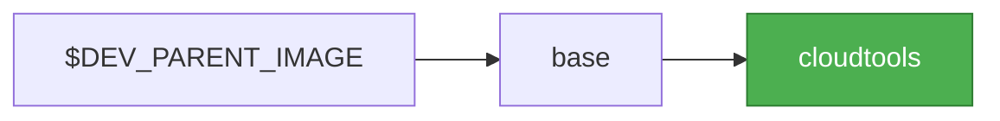
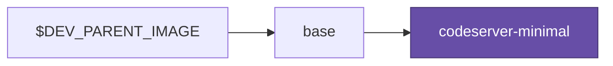
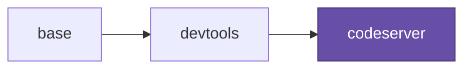

# Dockerfile

A detailed guide to the multi-stage Dockerfile, build targets, library scripts, and utility scripts.

## Folder Structure

```none
<root>
└── .devcontainer/
    └── docker/
        ├── .editorconfig
        ├── .env                      # Your .env file (not in version control)
        ├── Dockerfile                # Multi-stage Dockerfile
        ├── README.md                 # This file
        ├── sample.env                # The sample env file to be copied'
        ├── bin/                      # Shell scripts for container lifecycle management
        │   ├── all.sh
        │   ├── build.sh
        │   ├── clean.sh
        │   ├── executer.sh
        │   ├── loader.sh
        │   ├── login.sh
        │   ├── publish.sh
        │   └── run.sh
        ├── helpers/                  # Helper "scripts" with useful functions;
        │                               meant to be sourced from other scripts
        ├── lib-scripts/              # Container installer scripts
        ├── profile.d/                # Profile includes
        │   └── bash_colors.sh
        ├── scripts/                  # Container user scripts
        │   ├── post-start.sh
        │   └── start-code-server.sh
        └── utils/                    # Container utility scripts
            ├── fixpath.sh
            ├── healthcheck.sh
            ├── logger.sh
            ├── passgen.sh
            └── pipxpath.sh
```

## Environment Variables

1. Copy the [sample.env](./sample.env) and create a `.env`:

    ```bash
    cp sample.env .env
    ```

1. Now update the `.env` that was just created with the relevant information.
    - **REPO_NAME**: Should be the name of your repository
        (e.g. if the url is <https://github.com/octocat/Hello-World>,
        `REPO_NAME` would be _'Hello-World'_).
    - **REPO_NAMESPACE**: Should be namespace owner of the repo
        (e.g. if the url is <https://github.com/octocat/Hello-World>,
        `REPO_NAMESPACE` would be _'octocat'_)
    - **GITHUB_TOKEN**: The access token used to [publish](#publishsh)
        your image to the Github package registry.

> [!TIP]
> Optionally, manually load the `.env` file into your environment
> (not needed since the provided scripts will load the file):
>
> ```bash
> # ... load .env file, exporting all variables
> set -a; . .env; set +a
> ```

## Build Targets

The Dockerfile implements a multi-stage build with several specialized targets:



**Legend:**

| Element                                                                 | Meaning                                                                       |
| ----------------------------------------------------------------------- | ----------------------------------------------------------------------------- |
| Solid lines (➞)                                                         | `FROM` relationships (inheritance)                                            |
| Dashed lines (-.➝)                                                      | `COPY --from` relationships (resource copying)                                |
| Diamond node                                                            | Conditional choice based on build argument                                    |
| Light Blue Circle                                                       | File generator stages                                                         |
| [_Moby_ Blue](https://www.docker.com/company/newsroom/media-resources/) | Source parent image                                                           |
| **Green**                                                               | Primary development containers                                                |
| **Purple**                                                              | Specialized development containers                                            |
| **Medium Blue**                                                         | Temporary tool builder stages                                                 |
| **Dark Blue**                                                           | Intermediate builder stages                                                   |
| **$DEV_PARENT_IMAGE**                                                   | Build argument that determines whether base inherits from devuser or brewuser |

### 1. **`utils`** (`FROM alpine`)

A lightweight Alpine-based stage for preprocessing utility scripts before copying to scratch.



**Purpose**: Process and prepare utility scripts (logger.sh, passgen.sh) with sed replacements before collecting in filez
stage.

**Build Arguments**:

- `LOGGER` (default: `/usr/local/bin/logger.sh`) - Path to logger script
- `PASSGEN` (default: `/usr/local/bin/passgen.sh`) - Path to password generation script
- `DEFAULT_PASS_LENGTH` (default: `32`) - Default password length
- `DEFAULT_PASS_CHARSET` (default: `[:graph:]`) - Default password character set

**Key Features**:

- Copies logger.sh and passgen.sh from source
- Performs sed substitutions to inject build argument values into scripts
- Provides processed scripts to filez stage

**Environment Variables**: None (generator stage only)

### 2. **`filez`** (`FROM scratch`)

A scratch-based stage for collecting and organizing core helper scripts that are copied into other stages.



**Purpose**: Centralize script collection to avoid duplication across stages.

**Contents**:

- `logger.sh` - Logging utility
- `passgen.sh` - Password generation utility
- Helper scripts from `helpers/` directory

**Build Arguments**:

- `LOGGER` (default: `/usr/local/bin/logger.sh`) - Path to logger script
- `PASSGEN` (default: `/usr/local/bin/passgen.sh`) - Path to password generation script
- `DEFAULT_PASS_LENGTH` (default: `32`) - Default password length
- `DEFAULT_PASS_CHARSET` (default: `[:graph:]`) - Default password character set

**Environment Variables**: None (scratch-based stage)

### 3. **`builder`** (`FROM $BASE_IMAGE`)

Minimal Debian-based image with essential build tools and dependencies.



**Purpose**: Foundation for all other build targets.

**Uses**: [`builder-utils.sh`](#builder-utilssh)

**Key Features**:

- Installs common utilities (curl, vim, git, jq, yq, python3)
- Configures timezone and locale
- Removes default `ubuntu` user (Ubuntu 24+) to avoid UID conflicts
- Sets up password generation tools

**Build Arguments**:

- `IMAGE_NAME` (default: `ubuntu`) - Base image name
- `VARIANT` (default: `latest`) - Base image tag/version
- `TIMEZONE` (default: `UTC`) - Container timezone
- `LOGGER` (default: `/usr/local/bin/logger.sh`) - Path to logger script
- `PASSGEN` (default: `/usr/local/bin/passgen.sh`) - Path to password generation script
- `DEFAULT_PASS_LENGTH` (default: `32`) - Default password length
- `DEFAULT_PASS_CHARSET` (default: `[:graph:]`) - Default password character set

**Environment Variables**:

- `TZ` - Timezone (from build ARG)
- `LANG`, `LC_ALL` - Locale settings (C.UTF-8)
- `DEBIAN_FRONTEND` - Set to noninteractive
- `PASSGEN` - Path to password generation script (from build ARG)
- `DEFAULT_PASS_LENGTH` - Default password length (from build ARG)
- `DEFAULT_PASS_CHARSET` - Default password character set (from build ARG)

### 4. **`brewbuilder`** (`FROM builder`)

Installs Homebrew for Linux.


**Purpose**: Provide Homebrew for package management in development environments.

**Build Arguments**:

- `USERNAME` (default: `vscode`) - Non-root user name
- `USER_UID` (default: `1000`) - User ID
- `USER_GID` (default: `$USER_UID`) - Group ID

**Key Features**:

- Installs Homebrew under `/home/linuxbrew/.linuxbrew`
- Configures brew for the specified user

### 5. **`gobuilder`** (`FROM builder`)

Installs Go and Go-based tools.


**Purpose**: Build Go tools like shfmt for use in other stages.

**Uses**: [`go-install.sh`](#go-installsh)

**Build Arguments**:

- `USERNAME`, `USER_UID`, `USER_GID` - User configuration
- `GO_VERSION` (default: `latest`) - Go version to install

**Key Features**:

- Installs Go toolchain
- Builds and installs `shfmt` (shell formatter)

### 6. **`nodebuilder`** (`FROM builder`)

Installs Node.js and related tools.


**Purpose**: Provide Node.js runtime for development environments.

**Uses**: [`node-install.sh`](#node-installsh)

**Build Arguments**:

- `USERNAME`, `USER_UID`, `USER_GID` - User configuration
- `NODE_VERSION` (default: `lts`) - Node.js version

**Key Features**:

- Installs Node.js in `/usr/local/lib/node/nodejs`
- Includes npm and npx

**Environment Variables**:

- `NODEJS_HOME` - Node.js installation directory (`/usr/local/lib/nodejs`)
- `PATH` - Updated to include `$NODEJS_HOME/bin`

### 7. **`devbuilder`** (`FROM builder`)

Extended builder with development tools and configuration.


**Purpose**: Intermediate stage for development containers with Git, AWS CLI, and Terraform.

**Uses**: [`git-install.sh`](#git-installsh)

**Build Arguments**:

- `USERNAME` (default: `vscode`), `USER_UID` (default: `1000`), `USER_GID` (default: `$USER_UID`) - User configuration
- `BREW` (default: `/home/linuxbrew/.linuxbrew/bin/brew`) - Path to Homebrew binary
- `FIXPATH` (default: `/usr/local/bin/fixpath.sh`) - Installation path for PATH fixing utility
- `DEV` (default: `false`) - Development mode flag
- `GIT_VERSION` (default: `latest`) - Git version (`latest`, `system`, or specific version)
- `PYTHON_VERSION` (default: `latest`) - Python version to install
- `PRE_COMMIT_ENABLED` (default: `false`) - Enable pre-commit hooks
- `DEFAULT_ROOT_PASS` (default: `$DEV`) - Set default root password

**Environment Variables**:

- `PATH` - Updated to include `/home/$USERNAME/.local/bin`
- `PYTHON_VERSION` - Python version (exported from build ARG)
- `DEV` - Development mode flag (exported from build ARG)

### 8. **`devuser`** (`FROM devbuilder`)

Creates the non-root development user.



**Purpose**: Set up non-root user with sudo access and proper permissions.

**Uses**: [`devbuilder-user-setup.sh`](#devbuilder-user-setupsh)

**Key Features**:

- Creates user with specified UID/GID
- Grants passwordless sudo access
- Sets up SSH directory with proper permissions
- Optionally sets default root password (development only)
- Adds useful bash aliases system-wide

### 9. **`brewuser`** (`FROM devbuilder`)

Variant of `devuser` with Homebrew pre-installed.



**Purpose**: Development user with Homebrew available.

**Uses**: [`devbuilder-user-setup.sh`](#devbuilder-user-setupsh)

**Key Features**:

- Inherits from devbuilder
- Copies Homebrew installation from brewbuilder stage
- User has immediate access to brew commands

### 10. **`base`** (`FROM $DEV_PARENT_IMAGE`)

The primary base target for development containers.



**Purpose**: Complete development environment ready for use.

**Uses**: [`base-utils.sh`](#base-utilssh)

**Build Arguments**:

- `DEV_PARENT_IMAGE` (default: `devuser`) - Parent image (devuser or brewuser)
- `PIPX` (default: `/usr/local/bin/pipxpath.sh`) - Installation path for pipx wrapper script
- `PRE_COMMIT_ENABLED` (default: `false`) - Whether to install pre-commit
- `DEFAULT_WORKSPACE` (default: `/home/$USERNAME/workspace`) - Default workspace directory

**Key Features**:

- Copies shfmt from gobuilder
- Installs base utilities (openssh-client, optionally pre-commit)
- Sets up default workspace directory
- Configures proper PATH with fixpath.sh utility

**Environment Variables**:

- `LOGGER` - Path to logger script (from build ARG)
- `DEFAULT_WORKSPACE` - Default workspace path (from build ARG)
- `RESET_ROOT_PASS` - Root password reset flag (default: `false`)

### 11. **`devtools`** (`FROM base`)

Development container with Python, Node.js, and development tools.


**Purpose**: Full-featured development environment for Python and Node.js projects.

**Uses**: [`devtools-utils.sh`](#devtools-utilssh), [`python-install.sh`](#python-installsh)

**Build Arguments**:

- `NO_BREW_UPDATE` (default: `$DEV`) - Skip brew update if true

**Key Features**:

- Installs Python via Homebrew (if `PYTHON_VERSION` specified)
- Installs pipx, Poetry, and uv (Python package managers)
- Installs Node.js from nodebuilder stage
- Optionally installs pre-commit via pipx
- Includes docker-entrypoint.sh for container initialization

**Environment Variables**:

- `NODEJS_HOME` - Node.js installation path
- `RESET_ROOT_PASS` - Control root password reset at startup

**Entrypoint**: `docker-entrypoint.sh` - Handles root password reset and displays `fortune | cowsay`

### 12. **`cloudtools`** (`FROM base`)

Development container with cloud CLI tools.



**Purpose**: Container optimized for cloud infrastructure work.

**Uses**: [`cloud-cli-tools.sh`](#cloud-cli-toolssh)

**Key Features**:

- Installs AWS CLI v2
- Installs Terraform
- Enables AWS CLI bash completion
- Installs cfn-lint via pipx

### 13. **`codeserver-minimal`** (`FROM base`)

Minimal code-server container without development tools.



**Purpose**: Lightweight web-based VS Code instance.

**Uses**: [`codeserver-install.sh`](#codeserver-installsh), [`codeserver-utils.sh`](#codeserver-utilssh)

**Build Arguments**:

- `BIND_ADDR` (default: `0.0.0.0:13337`) - code-server bind address
- `DOWNLOAD_STANDALONE` (default: `true`) - Install as standalone tar.gz

**Key Features**:

- Installs code-server (Coder's VS Code in browser)
- Removes sudo access for security
- Includes healthcheck endpoint
- Configured with tini for proper signal handling

**Environment Variables**:

- `BIND_ADDR` - Bind address for code-server
- `CODE_SERVER_WORKSPACE` - Workspace directory
- `CODE_SERVER_CONFIG` - Config file path
- `CODE_SERVER_EXTENSIONS` - Extensions JSON path
- `DEBUG` - Debug mode flag

**Exposed Ports**: Port from `BIND_ADDR` (default: 13337)

**Healthcheck**: Checks `/healthz` endpoint every 30s

**Entrypoint**: `tini` for proper signal handling

### 14. **`codeserver`** (`FROM devtools`)

Full-featured code-server with development tools.



**Purpose**: Web-based VS Code with Python, Node.js, and development tools pre-installed.

**Uses**: [`codeserver-install.sh`](#codeserver-installsh), [`codeserver-utils.sh`](#codeserver-utilssh)

**Key Features**:

- All features from devtools target
- code-server installation
- Removes sudo access for security
- Same configuration as codeserver-minimal

### 15. **`production`** (`FROM builder`)

Minimal production-ready container.


**Purpose**: Lightweight container for production deployments.

**Key Features**:

- Based on minimal builder stage
- Includes tini for signal handling
- No development tools
- No non-root user configured

**Entrypoint**: `tini`

## Build Arguments

The Dockerfile accepts several build arguments for customization:

### Global Arguments (Available in Multiple Targets)

| Argument           | Default     | Used In                                         | Description                                        |
| ------------------ | ----------- | ----------------------------------------------- | -------------------------------------------------- |
| `IMAGE_NAME`       | `ubuntu`    | builder                                         | Base image name (must be Debian-based)             |
| `VARIANT`          | `latest`    | builder                                         | Base image tag/version                             |
| `BASE_IMAGE`       | Computed    | builder                                         | Full base image reference (`$IMAGE_NAME:$VARIANT`) |
| `DEV_PARENT_IMAGE` | `devuser`   | base                                            | Parent target (devuser or brewuser)                |
| `USERNAME`         | `vscode`    | brewbuilder, gobuilder, nodebuilder, devbuilder | Non-root user name                                 |
| `USER_UID`         | `1000`      | brewbuilder, gobuilder, nodebuilder, devbuilder | User ID for non-root user                          |
| `USER_GID`         | `$USER_UID` | brewbuilder, gobuilder, nodebuilder, devbuilder | Group ID for non-root user                         |

### Target-Specific Arguments

| Argument               | Default                      | Target         | Description                                                 |
| ---------------------- | ---------------------------- | -------------- | ----------------------------------------------------------- |
| `LOGGER`               | `/usr/local/bin/logger.sh`   | filez, builder | Path to logger script                                       |
| `PASSGEN`              | `/usr/local/bin/passgen.sh`  | filez, builder | Path to password generator script                           |
| `DEFAULT_PASS_CHARSET` | `[:graph:]`                  | filez, builder | Default character set for password generation               |
| `DEFAULT_PASS_LENGTH`  | `32`                         | filez, builder | Default password length                                     |
| `TIMEZONE`             | `UTC`                        | builder        | Container timezone                                          |
| `GO_VERSION`           | `latest`                     | gobuilder      | Go version to install                                       |
| `NODE_VERSION`         | `lts`                        | nodebuilder    | Node.js version (lts, latest, or specific)                  |
| `DEV`                  | `false`                      | devbuilder     | Development mode flag                                       |
| `GIT_VERSION`          | `system`                     | devbuilder     | Git version (system, latest, or specific)                   |
| `PYTHON_VERSION`       | `devcontainer`               | devbuilder     | Python version (devcontainer, system, latest, or specific)  |
| `PRE_COMMIT_ENABLED`   | `false`                      | devbuilder     | Install pre-commit hooks                                    |
| `DEFAULT_ROOT_PASS`    | `false`                      | devbuilder     | Set default root password (dev only)                        |
| `FIXPATH`              | `/usr/local/bin/fixpath.sh`  | devbuilder     | Installation path for PATH fixing utility (build-time only) |
| `PIPX`                 | `/usr/local/bin/pipxpath.sh` | devbuilder     | Installation path for pipx wrapper script (build-time only) |
| `BIND_ADDR`            | `0.0.0.0:13337`              | codeserver*    | code-server bind address                                    |
| `DOWNLOAD_STANDALONE`  | `true`                       | codeserver*    | Install code-server as standalone tar.gz                    |
| `NO_BREW_UPDATE`       | `$DEV`                       | devtools       | Skip Homebrew update during build                           |

### Environment Variables Set in Dockerfile

| Variable                 | Value                                                        | Target      | Description                            |
| ------------------------ | ------------------------------------------------------------ | ----------- | -------------------------------------- |
| `LOGGER`                 | `/usr/local/bin/logger.sh`                                   | builder     | Logger script path                     |
| `TZ`                     | `$TIMEZONE`                                                  | builder     | Timezone                               |
| `LANG`, `LC_ALL`         | `C.UTF-8`                                                    | builder     | Locale settings                        |
| `DEBIAN_FRONTEND`        | `noninteractive`                                             | builder     | Prevent interactive prompts            |
| `PASSGEN`                | `/usr/local/bin/passgen.sh`                                  | builder     | Password generator script path         |
| `DEFAULT_PASS_LENGTH`    | `32`                                                         | builder     | Default password length                |
| `DEFAULT_PASS_CHARSET`   | `[:graph:]`                                                  | builder     | Default password character set         |
| `PATH`                   | `/usr/local/lib/nodejs/bin:$PATH`                            | nodebuilder | Node.js binaries in PATH               |
| `NODEJS_HOME`            | `/usr/local/lib/nodejs`                                      | nodebuilder | Node.js installation directory         |
| `PATH`                   | `/home/$USERNAME/.local/bin:$PATH`                           | devbuilder  | User local binaries in PATH            |
| `PYTHON_VERSION`         | Build arg value                                              | devbuilder  | Python version to install              |
| `DEV`                    | Build arg value                                              | devbuilder  | Development mode flag                  |
| `DEFAULT_WORKSPACE`      | `/home/$USERNAME/workspace`                                  | base        | Default workspace directory            |
| `IGNOREEOF`              | `1`                                                          | base        | Prevent EOF (Ctrl+D) from exiting bash |
| `PATH`                   | `/home/$USERNAME/.local/lib/nodejs/bin:$PATH`                | devtools    | Node.js binaries in PATH               |
| `NODEJS_HOME`            | `/home/$USERNAME/.local/lib/nodejs`                          | devtools    | Node.js installation directory         |
| `BIND_ADDR`              | `0.0.0.0:13337`                                              | codeserver* | code-server bind address               |
| `CODE_SERVER_WORKSPACE`  | `$DEFAULT_WORKSPACE`                                         | codeserver* | code-server workspace path             |
| `CODE_SERVER_CONFIG`     | `/home/$USERNAME/.config/code-server/config.yaml`            | codeserver* | code-server config path                |
| `CODE_SERVER_EXTENSIONS` | `$DEFAULT_WORKSPACE/.code-server/extensions/extensions.json` | codeserver* | Extensions config                      |
| `DOWNLOAD_STANDALONE`    | `true`                                                       | codeserver* | Download standalone code-server        |
| `DEBUG`                  | `false`                                                      | codeserver* | Debug mode for code-server             |

> [!NOTE]
> The asterisk (*) notation (e.g., `codeserver*`) indicates a wildcard. In this case that the build argument or
> environment variable applies to both the `codeserver` and `codeserver-minimal` build targets.

### Additional Runtime Environment Variables

These environment variables can be set at container runtime (via `docker run -e VARIABLE=value` or docker-compose) to
control container behavior. They are used by runtime scripts like entrypoints and utilities.

| Variable          | Default | Used By              | Description                                                                         |
| ----------------- | ------- | -------------------- | ----------------------------------------------------------------------------------- |
| `RESET_ROOT_PASS` | `false` | docker-entrypoint.sh | Prompt to reset root password on container startup (devtools target)                |
| `EXIT_ON_EOF`     | `false` | healthcheck.sh       | Allow Ctrl+D (EOF) to exit the container when running interactively (base+ targets) |
| `DEBUG`           | `false` | start-code-server.sh | Enable debug logging for code-server startup (codeserver* targets)                  |
| `IGNOREEOF`       | `1`     | bash                 | Number of consecutive Ctrl+D presses required to exit bash (set in Dockerfile ENV)  |

**Examples:**

```bash
# Run with root password reset enabled
docker run -it -e RESET_ROOT_PASS=true ghcr.io/user/image:devtools

# Run with EOF exit enabled for testing
docker run -it -e EXIT_ON_EOF=true ghcr.io/user/image:base

# Run code-server with debug logging
docker run -it -e DEBUG=true ghcr.io/user/image:codeserver

# Disable Ctrl+D protection (allow single Ctrl+D to exit)
docker run -it -e IGNOREEOF=0 ghcr.io/user/image:base
```

> [!NOTE]
> As of Ubuntu 24+, a non-root `ubuntu` user (UID 1000) exists by default.
> The Dockerfile automatically removes this user to avoid conflicts when creating a custom user.
>
> See the [official docs](https://code.visualstudio.com/remote/advancedcontainers/add-nonroot-user)
> for more details on non-root users.

## Library Scripts (`lib-scripts/`)

Library scripts are installer and configuration scripts run during the Docker build process. They are copied to `/tmp/lib-scripts/`
and executed in the Dockerfile RUN commands.

### `base-utils.sh`

Installs base utilities required for development.

**Used by**: [`base`](#10-base-from-dev_parent_image)

**Packages Installed**:

- `openssh-client` - SSH client for remote connections
- `pre-commit` - Pre-commit hook framework (if `PRE_COMMIT_ENABLED=true` and pipx/brew not available)

**Dependencies**: Requires `/helpers/install-helper.sh`

### `builder-utils.sh`

Installs common utilities and dependencies for the builder stage.

**Used by**: [`builder`](#3-builder-from-base_image)

**Packages Installed**:

- `ca-certificates`, `gnupg2` - SSL/TLS certificates and GPG
- `curl`, `wget` - HTTP clients
- `vim`, `nano`, `less` - Text editors and pager
- `procps`, `lsb-release` - Process tools and system info
- `tzdata` - Timezone data
- `python3` - System Python3
- `jq`, `yq` - JSON and YAML processors

**Dependencies**: Requires `/helpers/install-helper.sh`

### `cloud-cli-tools.sh`

Installs cloud provider CLI tools and infrastructure management tools.

**Used by**: [`cloudtools`](#12-cloudtools-from-base)

**Tools Installed**:

- **AWS CLI v2** - AWS command-line interface (architecture-specific)
- **Terraform** - Infrastructure as code tool from HashiCorp
- AWS CLI bash completion for the non-root user

**Dependencies**: Requires `wget`, `unzip`, `gpg`

### `codeserver-install.sh`

Installs code-server (VS Code in the browser) from GitHub releases.

**Used by**: [`codeserver`](#14-codeserver-from-devtools), [`codeserver-minimal`](#13-codeserver-minimal-from-base)

**Installation Methods**:

- `.deb` package (when `DOWNLOAD_STANDALONE=false`)
- Standalone tar.gz (when `DOWNLOAD_STANDALONE=true`, default)

**Build Arguments**:

- `CODESERVER_VERSION` (default: `latest`) - code-server version
- `DOWNLOAD_STANDALONE` (default: `false`) - Installation method

**Features**:

- Automatically detects latest version from GitHub API
- Architecture-aware (amd64/arm64)
- Installs to `$HOME/.local/lib/code-server-$VERSION`

**Dependencies**: Requires `/helpers/install-helper.sh`

### `codeserver-utils.sh`

Utility configurations for code-server containers.

**Used by**: [`codeserver`](#14-codeserver-from-devtools), [`codeserver-minimal`](#13-codeserver-minimal-from-base)

**Functions**:

- Prepares system for code-server installation
- Installs tini for proper signal handling
- Configures non-root user environment

### `devbuilder-user-setup.sh`

Creates and configures the non-root development user.

**Used by**: [`devuser`](#8-devuser-from-devbuilder), [`brewuser`](#9-brewuser-from-devbuilder)

**Key Functions**:

- Sets up bashrc and profile for both root and new user
- Configures Homebrew environment (`brew shellenv`)
- Configures Python path (Homebrew or devcontainer Python)
- Creates non-root user with specified UID/GID
- Grants passwordless sudo access
- Sets up SSH directory with proper permissions
- Optionally sets default root password (development only)
- Adds system-wide bash aliases

**Build Arguments Used**:

- `USERNAME`, `USER_UID`, `USER_GID`
- `PYTHON_VERSION`
- `DEFAULT_ROOT_PASS`

**Environment Setup**:

- Homebrew integration in PATH
- Python path configuration
- PATH deduplication via fixpath.sh utility
- Bash completion for Homebrew

### `devtools-utils.sh`

Installs development tools and utilities.

**Used by**: [`devtools`](#11-devtools-from-base)

**Packages Installed**:

- Development build tools
- Version control utilities
- Editor and terminal enhancements
- `fortune-mod`, `cowsay` - Fun terminal utilities

**Dependencies**: Requires `/helpers/install-helper.sh`

### `git-install.sh`

Installs Git from source or uses system Git.

**Used by**: [`devbuilder`](#7-devbuilder-from-builder)

**Installation Options**:

- `system` - Use system-provided Git (default)
- `latest` - Build latest Git from source
- `X.Y.Z` - Build specific Git version from source

**Build Arguments**:

- `GIT_VERSION` (default: `system`)

**Features**:

- Downloads and compiles Git from official source
- Configures with common dependencies
- Installs to `/usr/local`

### `go-install.sh`

Installs Go toolchain and Go-based utilities.

**Used by**: [`gobuilder`](#5-gobuilder-from-builder)

**Installation**:

- Downloads official Go binary release
- Installs to `/usr/local/go`
- Builds `shfmt` (shell formatter) from source

**Build Arguments**:

- `GO_VERSION` (default: `latest`)

**Features**:

- Architecture-aware (amd64/arm64)
- Automatically fetches latest version if not specified

### `node-install.sh`

Installs Node.js and npm.

**Used by**: [`nodebuilder`](#6-nodebuilder-from-builder)

**Installation**:

- Downloads official Node.js binary release
- Installs to `/usr/local/lib/node/nodejs`
- Includes npm and npx

**Build Arguments**:

- `NODE_VERSION` (default: `lts`)

**Features**:

- Supports lts, latest, or specific versions
- Architecture-aware
- Creates installation script for reuse in other stages

### `python-install.sh`

Installs Python and configures Python environment.

**Used by**: [`devtools`](#11-devtools-from-base)

**Installation Options**:

- `system` - Use system Python3
- `devcontainer` - Use devcontainer Python feature
- `latest` - Install latest Python via Homebrew
- `X.Y` - Install specific Python version via Homebrew

**Build Arguments**:

- `PYTHON_VERSION` (default: `devcontainer`)

**Post-Installation**:

- Configures pipx (via Homebrew or system)
- Installs Poetry and uv (modern Python package managers)
- Optionally installs pre-commit via pipx

## Utility Scripts (`utils/`)

Utility scripts are helper scripts available at runtime in the container. They are copied to `/usr/local/bin/` and can
be invoked directly.

### `fixpath.sh`

Fixes and deduplicates the PATH environment variable.

**Installed at**: `/usr/local/bin/fixpath.sh`

**Usage**:

```bash
fixpath.sh [term] [path]
```

**Arguments**:

- `term` (default: `/usr/local/sbin`) - First common entry in PATH
- `path` (default: `$PATH`) - PATH string to fix

**Purpose**:

- Synchronizes container PATH with `/etc/environment`
- Removes duplicate PATH entries
- Ensures consistent PATH across shells and sessions

**Output**: Deduplicated PATH string

**Example**:

```bash
# Fix current PATH
PATH="$(fixpath.sh)"

# Fix custom PATH
PATH="$(fixpath.sh /usr/local/sbin "/custom/path:/usr/bin")"
```

> [!NOTE]
> The `FIXPATH` variable you may see in build documentation is a Docker build ARG that specifies the installation path
> during the build process. At runtime, simply invoke the script as shown above.

### `healthcheck.sh`

Container health monitoring utility.

**Usage**:

```bash
healthcheck [-i|--interactive]
```

**Purpose**:

- Monitors container health status
- Watches `/.healthcheck` file for status updates
- Provides interactive mode for debugging
- Handles graceful shutdown on EOF (Ctrl+D)

**Environment Variables**:

- `EXIT_ON_EOF` (default: `false`) - Exit on Ctrl+D

**Features**:

- Watches health status every 5 seconds
- Signal handling (INT, EXIT)
- Optional interactive output

### `logger.sh`

Logging utility for container scripts.

**Usage**:

```bash
logger [message]
LEVEL=error logger [message]
```

**Log Levels**:

- `info` (default) - Standard informational messages
- `error` - Error messages (red)
- `warn` - Warning messages (yellow)
- `success` / `√` - Success messages (green)
- `*`, `ƒ`, `!`, `**` - Various status indicators with colors

**Environment Variables**:

- `LEVEL` - Set log level for message

**Example**:

```bash
$LOGGER "Starting installation..."
LEVEL=error $LOGGER "Installation failed"
LEVEL=√ $LOGGER "Installation complete"
```

### `passgen.sh`

Secure password generation utility.

**Usage**:

```bash
passgen [quantity] [mode] [options] [positional_args]
```

**Quantity**: `-<n>`

Number of passwords to generate (default: 0; optional, numeric preceded by single dash).

- Default maximum is determined by a `DEFAULT_MAX_QTY` environment variable (default: 10000).
- `n=0` - This is the default quantity, and causes a single password to output without line breaks.
- `n>0,n<=$DEFAULT_MAX_QTY` - Causes _n_ number of passwords to output, with line breaks after each.

**Mode**:

- `-s, --simple` - Simple password (default)
- `-r, --requirements` - Password with character family requirements

**Options**:

- `-l, --length LENGTH` - Password length (default: 32)
- `-c, --charset CHARSET` - Character set for simple mode (default: [:graph:])
- `-m, --min-char-per-fam N` - Minimum chars per family for requirements mode (default: 2)

**Positional Arguments**:

- First positional argument (if numeric): Password length
- Cannot mix positional arguments with flag options

**Example Character Sets**:

- `[:graph:]` - All printable characters except space
- `[:alnum:]` - Alphanumeric only
- Custom: `a-zA-Z0-9!@#$%`

**Examples**:

```bash
# Generate one 32-character password
passgen

# Generate password with specific length (positional)
passgen 16

# Generate 5 passwords of length 20 (quantity shorthand with flag option)
passgen -5 -l 20

# Generate 3 passwords with positional length
passgen -3 16

# Requirements mode with min 2 chars from each family
passgen -r -l 16 -m 2

# Simple mode with custom charset
passgen -s -l 12 -c '[:alnum:]'

# Generate 10 requirements-mode passwords
passgen -10 -r -l 20 -m 3
```

**Features**:

- Uses `/dev/urandom` for cryptographic randomness
- GNU coreutils compatibility (prefers ghead, gfold, gshuf, gtr)
- Character family requirements: digits, lowercase, uppercase
- Shuffled output to distribute character families

### `pipxpath.sh`

Locates and invokes pipx binary.

**Installed at**: `/usr/local/bin/pipxpath.sh`

**Usage**:

```bash
# Get pipx path
pipxpath.sh

# Run pipx command
pipxpath.sh list
pipxpath.sh install poetry
```

**Purpose**:

- Finds pipx in system PATH or Homebrew
- Provides consistent pipx access across environments
- Wrapper script for locating and running pipx

**Output**: Path to pipx binary (if no arguments), or command output

**Example**:

```bash
# Get pipx path
PIPX_PATH="$(pipxpath.sh)"

# Use the script to run pipx commands
pipxpath.sh install pre-commit
pipxpath.sh list
```

> [!NOTE]
> The `PIPX` variable you may see in build documentation is a Docker build ARG that specifies the installation path during
> the build process. At runtime, simply invoke the script as shown above.

## Quick Start

The recommended workflow for working with the container image is:

1. **Build** the image locally
2. **Run** the container to test it
3. **Publish** the image to GitHub Container Registry
4. **Run** again using the published GHCR URL (optional verification)

## Build, Run, and Publish Scripts

### `build.sh`

Builds the Docker image from the Dockerfile.

#### <ins>Usage</ins>

```bash
build.sh <image-name[:build_target]> [build-args...] [options] [context]
```

**Arguments:**

- `image-name[:build_target]` - Image name with optional build target (e.g., `starter-project:devcontainer`)
- `build-args` - Build arguments passed to `docker build` (e.g., `--build-arg USERNAME=vscode`)
- `options` - Additional Docker build options (e.g., `--no-cache`, `--progress=plain`)
- `context` - Docker build context path (default: workspace root)

**Environment Variables:**

- `IMAGE_NAME` - Override image name
- `DOCKER_TARGET` - Override build target (default: `devcontainer`)
- `DOCKER_CONTEXT` - Override build context path
- `REMOTE_USER` - Override remote user (sets `--build-arg USERNAME=$REMOTE_USER`)

**Examples:**

```bash
# Build with default settings
./.devcontainer/docker/bin/build.sh starter-project

# Build with standard user and context
./.devcontainer/docker/bin/build.sh starter-project vscode .

# Build with build args and options
./.devcontainer/docker/bin/build.sh starter-project \
  --build-arg VARIANT=jammy \
  --no-cache \
  --progress=plain

# Build custom target
./.devcontainer/docker/bin/build.sh starter-project:production

# Using environment variables
IMAGE_NAME=starter-project \
DOCKER_TARGET=devcontainer \
REMOTE_USER=vscode \
DOCKER_CONTEXT=. \
./.devcontainer/docker/bin/build.sh
```

### `run.sh`

Runs the Docker container with the workspace mounted.

#### <ins>Usage</ins>

```bash
run.sh <image-name[:build_target]> [remote-user] [commands] [context]
```

**Arguments:**

- `image-name[:build_target]` - Image name with optional build target (required)
- `remote-user` - Username inside container (default: `devcontainer`)
- `context` - Local directory to mount as workspace (default: workspace root)

**Environment Variables:**

- `IMAGE_NAME` - Override image name
- `DOCKER_TARGET` - Override build target (default: `devcontainer`)
- `DOCKER_CONTEXT` - Override context path
- `REMOTE_USER` - Override remote user

**Examples:**

```bash
# Run with short form (adds :devcontainer automatically)
./.devcontainer/docker/bin/run.sh starter-project

# Run custom target
./.devcontainer/docker/bin/run.sh starter-project:production

# Run from GitHub Container Registry
./.devcontainer/docker/bin/run.sh \
  ghcr.io/stairwaytowonderland/starter-project:latest

# Run with custom user and context
./.devcontainer/docker/bin/run.sh starter-project vscode .
```

### `publish.sh`

Publishes the Docker image to GitHub Container Registry. Also performs cleanup by removing dangling images after tagging.

> [!NOTE]
> In order to publish to the github package registry, an access token is **required** for authentication.
>
> See the [official docs](https://docs.github.com/en/packages/working-with-a-github-packages-registry/working-with-the-container-registry#authenticating-with-a-personal-access-token-classic)
> for more details on **authenticating with a personal access token**.

#### <ins>Usage</ins>

```bash
publish.sh <image-name[:build_target]> [github-username] [image-version]
```

**Arguments:**

- `image-name[:build_target]` - Image name with optional build target (required)
- `github-username` - GitHub username (required, can use `REGISTRY_USER` env var)
- `image-version` - Version tag for the image (default: `latest`)

**Environment Variables:**

- `IMAGE_NAME` - Override image name
- `DOCKER_TARGET` - Override build target (default: `devcontainer`)
- `REGISTRY_USER` - GitHub username (alternative to argument)
- `IMAGE_VERSION` - Override version tag
- `CR_PAT` - GitHub Personal Access Token (required)

**Examples:**

```bash
# Publish with short form
./.devcontainer/docker/bin/publish.sh \
  starter-project \
  stairwaytowonderland

# Publish with all arguments
CR_PAT=<your-github-token> ./.devcontainer/docker/bin/publish.sh \
    starter-project:devcontainer \
    stairwaytowonderland \
    latest

# Using only environment variables
REGISTRY_USER=<your-github-user> \
CR_PAT=<your-github-token> \
IMAGE_NAME=starter-project \
./.devcontainer/docker/bin/publish.sh

# Using GitHub CLI token
export CR_PAT=$(gh auth token)
./.devcontainer/docker/bin/publish.sh \
  starter-project \
  stairwaytowonderland
```

### `clean.sh`

Removes all dangling (untagged) Docker images that are not associated with any container.
These are typically intermediate images left over from builds or retagging operations.

#### <ins>Usage</ins>

```bash
clean.sh
```

**Example:**

```bash
# Remove all dangling images
./.devcontainer/docker/bin/clean.sh
```

> [!NOTE]
> This script is provided for convenience and removes images that are no longer tagged or referenced.
> The publish script automatically performs basic cleanup, so this is typically only needed for manual cleanup operations.

## Recommended Workflow

```bash
# 1. Build the image with a custom user and context
./.devcontainer/docker/bin/build.sh starter-project vscode .

# 2. Test run locally with custom user and context
./.devcontainer/docker/bin/run.sh starter-project vscode .

# 3. Publish to GHCR
CR_PAT=<your_github_token> \
  ./.devcontainer/docker/bin/publish.sh \
    starter-project \
    <your_github_username>

# 4. (Optional) Test run from GHCR
./.devcontainer/docker/bin/run.sh \
  ghcr.io/<your_github_username>/starter-project:latest \
  vscode \
  .
```
